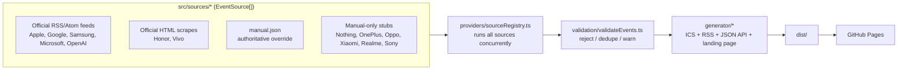

# TechCalendar

A curated, subscribable ICS calendar of **major, confirmed tech industry events** — Google I/O, Apple WWDC, Samsung Galaxy Unpacked, Microsoft Build, OpenAI DevDay, Android releases, and similar. Subscribe once in Google Calendar, Apple Calendar, Outlook, or TickTick and new confirmed events show up automatically.

**Manufacturers supported:** Google, Samsung, Apple, Microsoft, OpenAI, Nothing, OnePlus, Oppo, Xiaomi, Honor, Vivo, Realme, and Sony Xperia — each as its own `EventSource` (see the reliability table below for which have a real official feed today vs. which rely on `manual.json`).

**This is not a news feed.** Rumors, leaks, minor announcements, blog posts, patch notes, and marketing content are deliberately excluded. Only events with a confirmed date go in.

Deployed as a static public site on GitHub Pages: a landing page, six subscribable `.ics` calendars, a static JSON/REST-style API, and an RSS feed — all regenerated automatically.

## Philosophy

TechCalendar exists for one purpose: provide a clean, reliable calendar of major technology events.

We intentionally do **not** publish rumours, leaks, marketing, promotions, regional launches, colour variants, interviews, or blog posts. We only publish events that materially matter to technology enthusiasts.

When in doubt, we prefer missing an event over publishing an incorrect one. **Reliability is valued over completeness. Quality is valued over quantity.**

**For the full product manifesto** — mission, scope, inclusion/exclusion policy, quality and reliability principles, and contribution philosophy, written so you never need to read the source code to understand the project — see **[PRODUCT.md](PRODUCT.md)**. This README covers the technical *how*; PRODUCT.md is the *why*.

## Release policy

This isn't just a statement of intent — it's a first-class, enforced constant, [`RELEASE_POLICY`](src/policy/releasePolicy.ts):

```ts
interface ReleasePolicy {
  include: string[];
  exclude: string[];
}
```

| Include | Enforced by |
|---|---|
| Flagship smartphones | Per-vendor `INCLUDE_PATTERNS` in each source (e.g. Honor's `Magic`, vivo's `X\d{3}`) |
| Foldables | Same include patterns (e.g. `Magic\s?V\d`, `X Fold`) |
| Major OS releases | Android release keywords in `google.ts` (feed publish date trusted directly) |
| Major OS betas | Same, filtered to `Beta`/`QPR` |
| Feature drops | Same, filtered to `Feature Drop` |
| Developer conferences | Apple/Google/Microsoft/OpenAI keyword filters (`WWDC`, `I/O`, `Build`, `DevDay`) |
| AI conferences | OpenAI DevDay coverage (`ai` category) |
| Chip launches | **Not yet implemented** — no chip-vendor source exists today; listed here honestly as a policy gap, not silently dropped |

| Exclude | Enforced by |
|---|---|
| Regional launches *(secondary/follow-up rollouts only — see below)* | `DEFAULT_EXCLUDE_PATTERNS` in `src/utils/titleFilter.ts`: `now available in`, `rolling out to`, `expands to`, `coming soon to` |
| Availability announcements | `goes on sale`, `available now`, `now available` |
| Colour variants | `variant`, `color(way)`, `colour(way)` |
| Accessories | `accessor(y\|ies)` |
| Interviews | `interview`, leading `[Interview]` tags |
| Promotions | `promotion`, `campaign` |
| Discounts | `discount`, `price cut`, `offers?` |
| Software patches | `patch(es)` |
| Security advisories | `security advisory`, `vulnerabilit(y\|ies)` |
| Blog posts | Structural — every source filters to launch-shaped titles *before* this exclude list ever runs, so general blog content never reaches it |

**On "regional launches" specifically:** the distinction that matters is *first official launch announcement* vs. *secondary rollout*, not *regional vs. global*. If a manufacturer's only available official source is itself regional — vivo's newsroom is India-only — that source is authoritative for the product's initial launch, and its "Debuts"/"Unveils" reveal is published. What gets excluded is a *follow-up* regional rollout of a product that already had its reveal (e.g. "...launches in Western Europe" for a device announced months earlier elsewhere). `matchesLaunchTitle()` in `titleFilter.ts` has the full reasoning and test coverage for this.

## Install

Requires Node.js 22 and pnpm.

```bash
pnpm install
```

## Architecture



- **`src/models/TechEvent.ts`** — the `TechEvent` data model and the raw `ManualEventInput` shape used by `data/manual.json`.
- **`src/sources/*`** — one file per vendor, each implementing:
  ```ts
  interface EventSource {
    fetchEvents(): Promise<TechEvent[]>;
  }
  ```
  This is the only interface a source needs to satisfy — it's the extension point for the whole project.
- **`src/providers/sourceRegistry.ts`** — the single list of all registered sources, and `getAllEvents()`/`getAllEventsBySource()` which run them concurrently and merge results.
- **`src/validation/validateEvents.ts`** — the pre-publish validation pass over the full merged pool (see "Validation pipeline" below).
- **`src/generator/`** — turns a `TechEvent[]` into ICS text (`generateCalendar.ts`), an RSS 2.0 feed (`generateRss.ts`), and a JSON API payload (`renderApi.ts`); the config of which named calendars/API endpoints to emit and how to filter them (`outputs.ts`); the landing page renderer (`renderSite.ts`, templated from `src/site/template.html`); and the seam that gathers events for the CLI (`pipeline.ts`).
- **`src/utils/`** — deterministic ID hashing (`hash.ts`), deduplication (`dedupe.ts`), lightweight ICS structural validation (`validate.ts`), the shared HTTP client with per-process caching and per-hostname rate limiting (`httpCache.ts`), an RSS/Atom feed parser (`feedParser.ts`), an HTML newsroom scraper (`htmlScraper.ts`), launch-title include/exclude filtering (`titleFilter.ts`), a conservative text-to-date extractor (`extractDate.ts`), short curated event descriptions (`curatedDescriptions.ts`), and fetch-progress logging (`logger.ts`).
- **`src/cli/`** — the two entry points, `update.ts` and `build.ts`.

### Data flow

`pnpm build` runs, in order: (1) every registered source's `fetchEvents()` concurrently via the registry, each returning `TechEvent[]` or `[]` on failure — never throwing; (2) the full merged pool goes through `validateEvents()` once, producing `published`/`rejected`/`duplicates`/`warnings`; (3) only `published` events are fanned out to every enabled output in `outputs.ts` — each one filters that same canonical list (no output ever re-fetches or re-validates); (4) `dist/` is written (six `.ics` files, `/api/*`, `feed.xml`, `index.html`, `.nojekyll`, `build-report.txt`, and `CNAME` if configured); (5) CI commits and deploys it.

### Provider lifecycle

Every `EventSource` follows the same contract, regardless of tier:
1. Fetch its one official URL via `httpCache.fetchText()` (memoized per build, rate-limited to 1 req/sec/host).
2. Parse it — `feedParser.parseFeed()` for RSS/Atom, `htmlScraper.scrapeNewsroom()` for HTML — both return `[]` on any structural surprise, never throw.
3. Filter to launch-shaped titles only (`titleFilter.matchesLaunchTitle()` for scrapers; inline keyword regexes for feeds).
4. Extract/derive a confirmed date (`extractDate.extractConfidentDate()`, or the feed's own `publishedAt` for retrospective release posts) — skip the item (log + continue) if no confident date exists.
5. Prefer a short curated description (`curatedDescriptions.getCuratedDescription()`) over raw article text.
6. Tag the event with `company`, `sourceType` (`"official-feed" | "official-scrape" | "manual"`), and `allDay` (true whenever only a calendar date, not a real time, is known).
7. Wrap the whole thing in try/catch — return `[]` on any failure. One broken source never blocks the build.

### Validation pipeline

`src/validation/validateEvents.ts` runs once, on the full merged pool, before any output is generated:

| Check | Outcome |
|---|---|
| Empty/whitespace title | **Reject** |
| Invalid/NaN start or end date | **Reject** |
| `end` before `start` | **Reject** |
| Category not in `VALID_CATEGORIES` / importance not in `VALID_IMPORTANCE` | **Reject** |
| `sourceType` not one of the three valid values | **Reject** |
| `url` missing, empty, or not a syntactically valid `http(s)` URL | **Reject** |
| `description` missing or empty | **Reject** |
| Start date implausibly far past/future (outside roughly `now ± 2–3 years`) | **Reject** — catches date-parsing bugs, not just bad data |
| Duplicate `category`+`title`+`day` (same key `hash.ts` uses) | **Tracked as duplicate**, first-seen copy published |

Rejected/duplicate events never reach any `.ics`/API/RSS output. This is a separate, earlier check from `validate.ts`'s `validateIcs()`, which only verifies the *generated ICS structure* is well-formed — and a separate, earlier check again from `productionGuard.ts`'s placeholder scan (see "Production Data Policy" below), which is a hard *build* failure rather than a per-event rejection. All three are complementary, not redundant.

### Event vs. article-about-an-event

A newsroom/feed naturally contains far more coverage than actual launch events: interviews, infographics, invitations, hands-on impressions, deep dives, recaps, and awards/recognition pieces about a product all mention the product without being the launch itself. Two complementary mechanisms keep only the real event:

1. **Title-type exclusion.** `DERIVATIVE_COVERAGE_PATTERNS` in [`src/utils/titleFilter.ts`](src/utils/titleFilter.ts) rejects titles matching interview/infographic/invitation/hands-on/deep-dive/recap/recognition/leadership/awards/"first to support...beta" wording, applied identically by **every** source — including the RSS/feed sources (Apple, Google, Samsung, Microsoft, OpenAI), which previously used their own unfiltered keyword regex and were not catching this. One exception, `google.ts`'s Android release branch, intentionally uses a narrower exclude list (`DERIVATIVE_COVERAGE_PATTERNS` + patch/security-advisory patterns only) — the full default list's "now available" exclusion is meant for hardware-sales notices and would incorrectly reject legitimate software-rollout phrasing like "Android 17 QPR1 Feature Drop **is now available**."
2. **Canonical event detection.** Even after excluding obvious article-types, two genuinely launch-shaped titles can still describe the *same* real-world event — e.g. a teaser and its regional follow-up, published days apart. [`src/validation/canonicalEventFilter.ts`](src/validation/canonicalEventFilter.ts) groups published events by `company` (falling back to `category`), clusters each group by a rolling 14-day window (chosen over a fixed calendar bucket so it doesn't split or merge events sitting near a boundary), and keeps exactly one event per cluster — preferring a title with an explicit launch verb (`Launches`/`Unveils`/`Debuts`/`Announces`) that isn't itself derivative coverage, then the earliest by date. Everything else in the cluster is rejected and listed in the build report as a "canonical duplicate."

Verified live: this correctly dropped Samsung to 0 published events (its current newsroom feed's only Unpacked-dated articles were `[Interview]`/`[Infographic]`/`[Invitation]` coverage — never the announcement itself) and collapsed Honor's Magic V5 teaser + Western-Europe-rollout pair into one. Both are the intended outcome of "reliability over completeness, missing over wrong" — not bugs.

### Reliability policy: most reliable official source available, no fragile scraping

This project follows **reliability over automation** — but that does *not* mean "no official feed means manual.json only." The actual rule is: use the most reliable **official** source available, in this order of preference: (1) an official RSS/Atom feed, (2) an official newsroom page that's server-rendered and has stable, specific CSS selectors, (3) if neither exists — the page is client-rendered (JS-only), unreachable, or not phone-specific — fall back to `manual.json` and say so honestly in the source code. Concretely, per vendor:

| Vendor / source file | Official source used | Notes |
|---|---|---|
| Apple (`apple.ts`) | `https://www.apple.com/newsroom/rss-feed.rss` | Apple's general newsroom feed, filtered for WWDC / special-event / keynote coverage. Apple often doesn't publish a newsroom article until the event itself — add confirmed WWDC/September/October dates to `manual.json` as soon as Apple's invite goes out. |
| Google — Android releases (`google.ts`) | `https://android-developers.googleblog.com/atom.xml` | Official Android Developers Blog. Stable/Beta/Feature Drop rollout posts are retrospective, so the post's own publish date is trusted directly as the confirmed release date — no guessing involved. |
| Google — I/O & Made by Google/Pixel (`google.ts`) | same Android Developers Blog feed, best-effort | No dedicated official feed with structured forward-looking dates exists for I/O or Made by Google (which is also where Pixel hardware launches — there is no separate Pixel source, it's the same real-world event). This source only emits an event when it can extract an explicit, unambiguous date from the article text; otherwise it logs a notice and skips. `manual.json` is the reliable path for these. |
| Samsung (`samsung.ts`) | `https://news.samsung.com/global/feed` | Samsung Global Newsroom feed, filtered for "Unpacked". Newsroom coverage clusters around/after the event (recap articles, interviews) more than months in advance, so this is better at confirming an event happened than at giving early notice — add advance Unpacked dates to `manual.json` as soon as Samsung's own invite goes out. |
| Microsoft Build (`microsoft.ts`) | `https://news.microsoft.com/feed/` | Microsoft's general corporate press feed (earnings, CSR, partnerships) — no dedicated Build-announcement feed exists, so this is a low-signal, best-effort filter for "Microsoft Build" mentions. `manual.json` is the reliable path. |
| OpenAI DevDay (`openai.ts`) | `https://openai.com/news/rss.xml` | Official OpenAI news feed, filtered for "DevDay". |
| **Honor** (`honor.ts`) | `https://www.honor.com/global/news/archive/` **(HTML scrape)** | No RSS/Atom feed, but this page is server-rendered with real, stable article markup — scraped via `src/utils/htmlScraper.ts`, filtered to Magic-series phones/foldables and numbered-series flagship launches only (`src/utils/titleFilter.ts` rejects campaigns, awards shows, and minor-device posts even when they say "launched"). |
| **Vivo** (`vivo.ts`) | `https://vivonewsroom.in/press-releases/` **(HTML scrape)** | vivo's India newsroom — the only public vivo newsroom with real article content found; also server-rendered and scraped the same way, filtered to X-series/X Fold flagship launches. The live feed mixes genuine launches with sales/variant/CSR posts in the same list; the exclude-wins-over-include filter (see below) is what keeps those out. |
| Nothing (`nothing.ts`) | **None found.** | No official RSS/Atom feed or structured events page was discoverable — only third-party aggregators. `manual.json` only. |
| OnePlus (`oneplus.ts`) | **None found.** | Same as Nothing — no official feed discoverable. `manual.json` only. |
| Oppo (`oppo.ts`) | **None reachable.** | oppo.com/en/newsroom/press/ was fetched directly — it's a client-side app shell with zero article content in the server HTML. Nothing to scrape without running a full browser. `manual.json` only. |
| Xiaomi (`xiaomi.ts`) | **None reachable.** | mi.com/global/discover/newsroom was fetched directly — confirmed to return only nav/skeleton markup, no article content or embedded JSON; news loads client-side. `manual.json` only. |
| Realme (`realme.ts`) | **None reachable.** | Several plausible official newsroom URLs were fetched directly and all returned 403/404 — no reachable official page at all. `manual.json` only. |
| Sony Xperia (`sony.ts`) | **None reachable.** | Sony's corporate news page is a client-side filter UI with no static content, and it's Sony-wide, not Xperia-specific; no dedicated Xperia press page was reachable. `manual.json` only. |
| `manual.ts` | `data/manual.json` | The authoritative source for everything above, and the only source for Nothing, OnePlus, Oppo, Xiaomi, Realme, and Sony Xperia. Malformed data here throws loudly rather than being silently skipped. |

For every manufacturer, `manual.json` is where confirmed **launch events, new flagship phones, foldables, tablets, smartwatches, and major software announcements** go — availability/sales press releases, discounts, minor accessories, and color-variant announcements are intentionally never in scope, official feed or not.

**How the newsroom scrapers stay safe:**
- **Stable, specific CSS selectors** (`src/utils/htmlScraper.ts`, via `cheerio`) — never regex-scraping raw HTML.
- **Strict title filtering, exclude-always-wins** (`src/utils/titleFilter.ts`) — a title must match a vendor-specific include pattern (product line names like "Magic", "X300") *and* match none of the shared exclude patterns (sale, discount, offer, variant, color, accessory, campaign, promotion, availability wording). This is what correctly rejects real examples like "vivo's Latest Compact Flagship X300 FE Goes On Sale With Exciting Launch Offers" even though it mentions a flagship name.
- **Never throws.** Any parsing failure, missing selector, or unexpected structure resolves to `[]`, exactly like every other source — one broken scraper never blocks the build.
- **Snapshot regression tests.** `test/fixtures/html/*.html` are trimmed, real-structure snapshots of each scraped page; `test/utils/htmlScraper.test.ts` and the per-source tests run entirely offline against them. If Honor or Vivo redesign their site, these tests keep passing (they don't hit the network) — but the next *live* build would then silently start returning zero events from that source rather than fabricating incorrect ones. That trade-off — missing events over inventing them — is intentional.

Every real source wraps its fetch in try/catch and returns `[]` on failure — a single vendor's feed being unreachable never breaks the build (`sourceRegistry.ts` already treats a rejected non-manual source as a warning, not a fatal error).

**Caching & rate limiting:** all HTTP fetches go through `src/utils/httpCache.ts`, which memoizes each URL for the lifetime of a single `update`/`build` run (a URL is never downloaded twice in one build) and enforces a hard **max of 1 request per second per hostname**.

**Confirmed dates only:** `src/utils/extractDate.ts` only returns a date when the source text contains an explicit, unambiguous month/day (optionally with year) or ISO date — vague phrasing ("later this year", "this fall") always resolves to `undefined`, and callers skip the item rather than emit a guessed date.

## Adding a source

1. Create (or edit) a file under `src/sources/` exporting a class that implements `EventSource`.
2. Register an instance of it in the `allSources` array in [`src/providers/sourceRegistry.ts`](src/providers/sourceRegistry.ts).
3. That's it — the generator, CLI, and tests all consume `getAllEvents()` and don't need any changes.

A source should never throw for "no events found" — return `[]`. Wrap any real fetch logic in try/catch and fail soft, since one broken source must never block the whole build (the registry already treats a rejected stub source as a warning, not a fatal error — `ManualSource` is the one exception, since a bug there means genuinely broken data).

## Adding manual events

Edit [`data/manual.json`](data/manual.json), an array of:

```json
{
  "title": "Pixel 11 Launch Event",
  "date": "2027-08-18T17:00:00Z",
  "endDate": "2027-08-18T19:00:00Z",
  "description": "Google's annual Pixel hardware launch event.",
  "url": "https://store.google.com/",
  "location": "Optional location string",
  "category": "google",
  "importance": "major",
  "confirmed": true
}
```

| Field | Required | Notes |
|---|---|---|
| `title` | yes | Event name. |
| `date` | yes | ISO 8601 date/time. A bare date (`"2027-08-18"`, no `T...`) is treated as **all-day** (no fabricated time); include a time (`"2027-08-18T17:00:00Z"`) when you know the actual scheduled time. |
| `endDate` | no | ISO 8601 end date/time. |
| `description` | **yes** | Required per the Production Data Policy below — an event with no description is rejected, not just warned about. |
| `url` | **yes** | The official source URL. Required for the same reason. |
| `location` | no | |
| `category` | yes | One of `android`, `apple`, `google`, `microsoft`, `ai`, `hardware`, `conference`. |
| `importance` | no | `major` or `normal`. Defaults to `normal`. |
| `company` | no | Manufacturer/organization name, e.g. `"Samsung"` — recommended for `hardware`-category events, since several manufacturers share that one category. |
| `confirmed` | **yes** | `true` or `false`. `false` (or anything other than literal `true`) means the entry is **skipped**, not published — logged as `Skipped unconfirmed manual event.` This lets you track a not-yet-official date in the file without it ever reaching a calendar. |

Never add an `id` field — IDs are always derived deterministically from `category` + `title` + `date`, so editing a description or URL later won't change an event's identity or create a duplicate. `sourceType` is always set to `"manual"` automatically — it's not a JSON field.

`data/manual.json` ships as an empty array (`[]`) — per the Production Data Policy, no placeholder or example entries are kept in the repo. Add real, officially confirmed events only, with `"confirmed": true`.

`data/manual.json` takes precedence over every other source: if a manual entry and a stub-source entry resolve to the same `category`+`title`+`date`, the manual one wins.

## Production Data Policy

**No placeholder, example, guessed, or unverified event may ever be published — this is enforced by the build, not just by convention.**

- **Placeholder guard (hard build failure).** [`src/validation/productionGuard.ts`](src/validation/productionGuard.ts) scans every event about to be published — title, description, url, location — for the markers `EXAMPLE`, `PLACEHOLDER`, `TODO`, `TBD`, `COMING SOON` (case-insensitive), dummy URLs (`example.com`, `localhost`, etc.), and fake location values (`TBD`, `N/A`, `Unknown`, `Somewhere`). Any match **throws and fails the build**, with a message naming the exact event, field, and marker responsible — this is a different, stronger response than the validation pipeline's per-event rejection below, because a placeholder reaching the published pool signals contaminated input (bad merge, leftover test data), not an isolated bad event.
- **`confirmed` gate on manual events.** See the table above — an entry without `"confirmed": true` is skipped and reported, never published.
- **Reject rules, tightened.** [`validateEvents.ts`](src/validation/validateEvents.ts) rejects (excludes from every output) any event missing a title, a confirmed date, a valid category/importance, a valid `sourceType`, **an official URL, or a description** — the last two used to be warnings; they're rejections now, matching the rule "an event may only be published when official source, official URL, confirmed date, title, and description all exist."
- **Nothing is ever guessed.** `extractConfidentDate` (used by every RSS/scrape source) returns `undefined` — causing the item to be skipped, not defaulted — whenever the source text doesn't contain an explicit, unambiguous date.

Try it yourself: add an event to `data/manual.json` with `"EXAMPLE"` anywhere in its title and run `pnpm build` — the build fails immediately, naming that exact event.

## Generated outputs

[`src/generator/outputs.ts`](src/generator/outputs.ts) is the single config driving every `.ics` file, every API endpoint, and the landing page's download list at once — they can never drift out of sync. Each entry has `name` (ICS filename stem), `apiName` (JSON API path), a `filter`, and `enabled`. Currently all six are enabled:

| `.ics` file | Filter | JSON API |
|---|---|---|
| `calendar.ics` | all events | `/api/events` |
| `android.ics` | `category === "android"` | `/api/android` |
| `apple.ics` | `category === "apple"` | `/api/apple` |
| `google.ics` | `category === "google"` | `/api/google` |
| `ai.ics` | `category === "ai"` | `/api/ai` |
| `major.ics` | `importance === "major"` | `/api/major` |

To add another filtered output later (e.g. `hardware.ics`), add one entry to `outputConfigs` — no other code changes needed.

## JSON / REST API

**Important architectural note:** GitHub Pages serves static files only — there is no live server. "REST API" here means precomputed, static JSON files at clean URLs, regenerated on every build (daily, or immediately on push — see Deployment). It's read-only and not query-able; think of it as a machine-readable mirror of the `.ics` files, not a dynamic backend.

Each endpoint above is written twice: `/api/<name>.json` (explicit extension) and `/api/<name>` (extensionless, for the exact clean path). Payload shape:

```json
{
  "generatedAt": "2026-07-31T12:00:00.000Z",
  "count": 2,
  "events": [
    {
      "id": "google-...",
      "title": "Google I/O 2027",
      "description": "...",
      "start": "2027-05-18T17:00:00.000Z",
      "end": "2027-05-18T19:00:00.000Z",
      "location": "Mountain View, CA",
      "url": "https://io.google/",
      "category": "google",
      "importance": "major",
      "company": "Google",
      "sourceType": "official-feed",
      "allDay": true
    }
  ]
}
```

## RSS feed

`dist/feed.xml` is a single RSS 2.0 feed covering every event (unfiltered), for feed readers. Each event's own start date is used as the item's `pubDate`.

## ICS compatibility details

Two calendar-level properties were added for maximum client compatibility, both verified directly against `ical-generator`'s actual output before shipping (not assumed from documentation):
- **`REFRESH-INTERVAL;VALUE=DURATION:P1D`** — a real RFC 7986 property (an IETF standard extending iCalendar), telling a subscribing client how often to re-poll.
- **`X-PUBLISHED-TTL:P1D`** — a long-established de facto convention (an `X-`-prefixed extension per RFC5545's own mechanism), honored especially by Outlook.

Both are set via `ical-generator`'s native `ttl` option (24 hours, matching this project's actual daily build cadence — not a guessed number) rather than hand-written properties.

**SEQUENCE** is deterministic and persisted, never random or purely static. A pure content-hash would technically be "deterministic" but not *monotonic* — hashes don't increase in a meaningful order, which defeats the point of SEQUENCE (telling a client "this is newer than what you saw before"). Instead, [`src/generator/sequenceTracker.ts`](src/generator/sequenceTracker.ts) compares each build's event content against `dist/sequence-state.json` (committed to git, like the rest of `dist/`, so it persists across CI runs): a new event starts at `SEQUENCE:0`; unchanged content keeps its previous sequence; changed content increments it by exactly 1.

Every event is also always emitted with `STATUS:CONFIRMED` and `TRANSP:TRANSPARENT`, and date-only events use `DTSTART;VALUE=DATE` (all-day) rather than a fabricated midnight timestamp — see "Data flow" and the `allDay` field above.

## Build report

Every `pnpm build` prints, and writes to `dist/build-report.txt`, a consolidated report: per-source event counts, then published/rejected/duplicate/warning totals and build time:

```
------------------------------------
ManualSource ....... 0 events
Google ............. 1 events
Samsung ............ 0 events
Honor .............. 8 events
Vivo ............... 2 events
...
------------------------------------
Published .......... 10
Rejected ........... 0
Duplicates ......... 0
Canonical duplicates . 2
Warnings ........... 0
Build time ......... 1.0 sec
------------------------------------
```
If anything was rejected or warned about, the specific event titles and reasons are listed below the summary — this is the first thing to check if a run publishes fewer events than expected.

## Landing page

`dist/index.html` is a self-contained (no CDN/font dependencies), dark/light-aware landing page rendered at build time from [`src/site/template.html`](src/site/template.html) by [`src/generator/renderSite.ts`](src/generator/renderSite.ts) — its stats, download links, and API table are always generated from the real build output, never hand-maintained.

## Running locally

```bash
pnpm update   # refreshes all sources, writes a diagnostic snapshot to cache/
pnpm build    # generates dist/: all .ics files, /api/*, feed.xml, index.html
pnpm test     # runs the Vitest suite
pnpm lint     # ESLint
pnpm format   # Prettier --write
```

## Deployment

[`.github/workflows/calendar.yml`](.github/workflows/calendar.yml) runs on a daily 05:00 UTC cron, on every push to `main`, and on manual dispatch:

1. Installs dependencies with pnpm.
2. Runs `pnpm update` then `pnpm build` (this produces everything: `.ics` files, `/api/*`, `feed.xml`, `index.html`, `.nojekyll`, and `CNAME` if configured), then the test suite.
3. Commits `dist/*` back to the repo if anything changed (tagged `[skip ci]` to avoid re-triggering itself).
4. Publishes the `dist/` folder to GitHub Pages.

To enable this: push the repo to GitHub, enable GitHub Pages with source set to "GitHub Actions" (Settings → Pages), and the workflow handles the rest. The build step sets `SITE_URL`/`REPO_URL` automatically from GitHub's repository context, so the landing page, RSS feed, and API examples always point at the right URL without manual configuration.

## Custom domain

By default the site is served from `https://<owner>.github.io/<repo>`. To use your own domain instead:

1. Create a file named exactly `CNAME` (no extension) at the **repository root** containing just your domain, e.g. `calendar.example.com`.
2. Add the corresponding DNS record at your registrar:
   - **Subdomain** (e.g. `calendar.example.com`): a `CNAME` record pointing to `<owner>.github.io`.
   - **Apex/root domain** (e.g. `example.com`): four `A` records pointing to GitHub Pages' IPs (`185.199.108.153`, `185.199.109.153`, `185.199.110.153`, `185.199.111.153`), plus optionally an `AAAA` set for IPv6.
3. Commit the `CNAME` file and push (or wait for the next scheduled build). `pnpm build` automatically copies it into `dist/CNAME` and switches every generated link (landing page, RSS, API examples) to use `https://<your-domain>` instead of the `github.io` URL.
4. In the repo's Settings → Pages, confirm the custom domain shows as verified and enable "Enforce HTTPS" once GitHub has provisioned the certificate.

No `CNAME` file exists in this repo by default — until one is added, everything correctly uses the `github.io` URL.

## Subscribing to the calendar

Once deployed, your calendars are reachable at URLs like:

```
https://<your-username>.github.io/<your-repo>/calendar.ics
https://<your-username>.github.io/<your-repo>/android.ics
```
(or `https://<your-domain>/calendar.ics` etc. once a custom domain is configured).

- **Google Calendar**: "Other calendars" → "+" → "From URL", paste the `https://` URL.
- **Apple Calendar**: File → New Calendar Subscription, paste the URL (works with either `https://` or `webcal://` — swapping the scheme to `webcal://` makes some platforms auto-open their calendar app instead of downloading the file).
- **Outlook**: Add calendar → Subscribe from web, paste the `https://` URL.
- **TickTick**: Settings → Calendar Subscription, paste the `https://` URL.

Subscribing (as opposed to a one-time import) means your calendar app periodically re-fetches the URL and picks up new/changed events automatically as each build updates the file.
